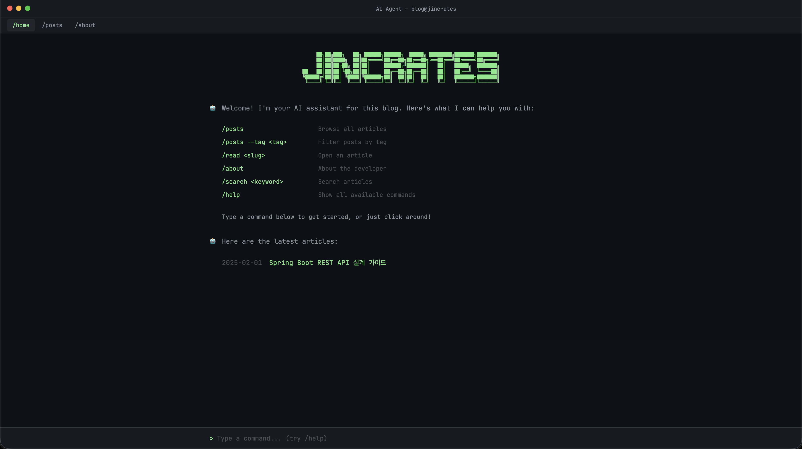

# Jincrates Blog — AI CLI Agent Theme

터미널에서 AI CLI 에이전트를 사용하는 것 같은 인터랙티브 기술 블로그.
Jekyll + GitHub Pages 기반.

**Demo**: [jincrates.github.io](https://jincrates.github.io)



## Quick Start

```bash
# 로컬 개발 서버 실행
gem install bundler
bundle install
bundle exec jekyll serve

# http://localhost:4000 에서 확인
```

## Slash Commands

| Command | Description |
|---------|-------------|
| `/home` | 메인 페이지 |
| `/posts` | 전체 글 목록 |
| `/posts --tag <tag>` | 태그 필터링 |
| `/posts --category <cat>` | 카테고리 필터 |
| `/read <slug>` | 글 상세 페이지 |
| `/about` | 소개 페이지 (경력/프로젝트 포함) |
| `/search <keyword>` | 검색 |
| `/help` | 커맨드 목록 |

## Adding a New Post

`_posts/` 디렉토리에 `YYYY-MM-DD-title.md` 형식으로 파일 생성:

```markdown
---
layout: post
title: "Your Post Title"
date: 2025-03-01
tags: [spring, backend]
categories: [spring]
---

Your content here...
```

## Adding a New Command

`assets/js/agent.js`의 `executeCommand()` 함수에 새 case 추가:

```javascript
case '/mycommand':
  navigateTo('/my-page/');
  break;
```

## Enabling Giscus Comments

1. [giscus.app](https://giscus.app)에서 설정 생성
2. `_layouts/post.html`의 Giscus 주석 해제
3. `data-repo-id`, `data-category-id` 값 교체

## Customization

- **Colors**: `_sass/_variables.scss`에서 컬러 토큰 변경
- **ASCII Banner**: `_includes/ascii-banner.html` 수정
- **Fonts**: `_layouts/` 파일의 Google Fonts 링크 변경
- **Navigation**: `_includes/terminal-frame.html`에서 메뉴 수정

## Structure

```
├── _layouts/          # HTML 레이아웃 (default, home, post)
├── _includes/         # UI 컴포넌트 (terminal-frame, command-input, etc.)
├── _sass/             # SCSS 스타일시트
├── _posts/            # 블로그 포스트 (Markdown)
├── assets/
│   ├── css/main.scss  # SCSS 엔트리포인트
│   ├── js/            # 에이전트 로직 (agent.js, typing.js, spinner.js)
│   └── img/           # 이미지 (favicon, profile)
├── pages/             # 정적 페이지 (about, posts)
├── _config.yml        # Jekyll 설정
└── index.html         # 홈 페이지
```
